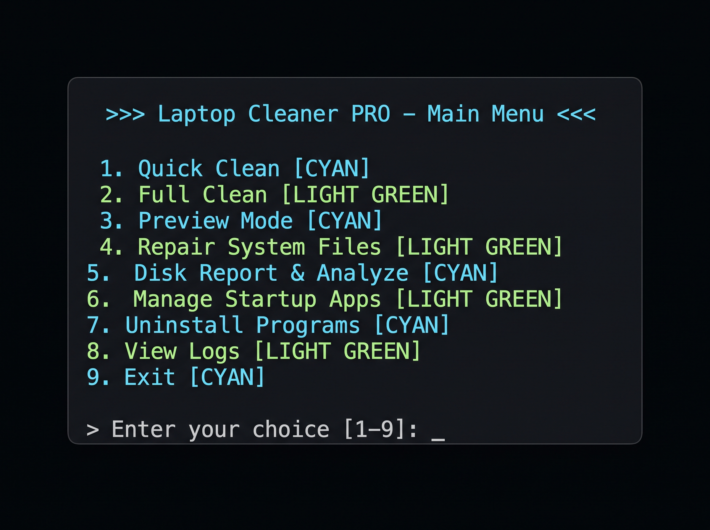
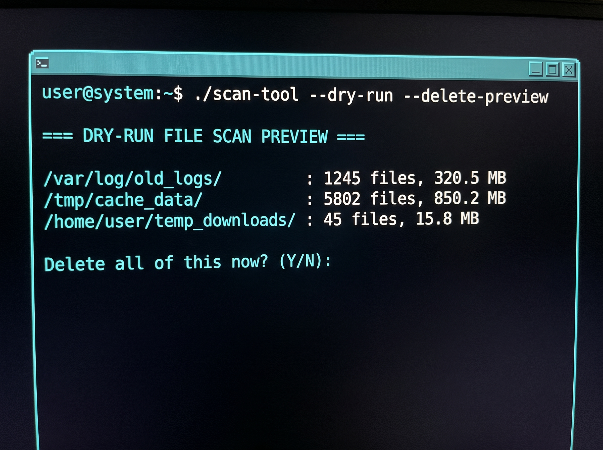
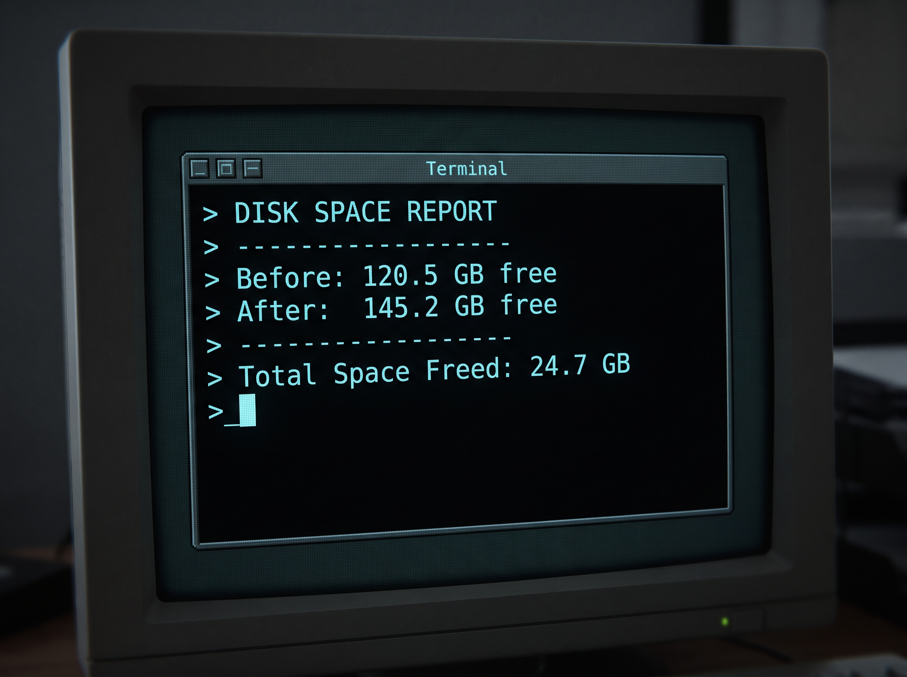

<div align="center">

# 🧹 Laptop Cleaner PRO

**A fast, safe, all-in-one Windows batch tool** to clean junk, free up disk space, and repair system files — no installation required.

[](https://github.com/BuildsByAliyan/laptop-cleaner-pro)
[](LICENSE)
[](https://github.com/BuildsByAliyan/laptop-cleaner-pro)

</div>

---

## 📖 Table of Contents
- [Overview](#-overview)
- [Versions](#-versions)
- [Features](#-features)
- [Screenshots](#-screenshots)
- [Installation](#-installation)
- [Important Notes](#️-important-notes)
- [License](#-license)

---

## 🔎 Overview

Laptop Cleaner PRO is a menu-driven batch tool that clears temporary files, prefetch data, the Recycle Bin, Windows Update cache, and thumbnail cache, flushes DNS, and can repair corrupted system files using SFC and DISM — all from a single script, with no third-party software or installation needed.

## 📦 Versions

| File | Description |
|---|---|
| `clean.bat` | Simple, one-click basic cleaner |
| `clean-pro.bat` | Advanced menu-based tool with auto admin-elevation, logging, and repair options |
| `clean-pro-v2.bat` | **Recommended** — everything in `clean-pro.bat` plus Before/After reports, Preview Mode, Browser Cache Cleaner, and Duplicate Files Finder |

## ✨ Features

- ✅ **Quick Clean** — Temp files, Prefetch, and Recycle Bin
- ✅ **Full Clean** — Quick Clean + Windows Update cache + Thumbnail cache + DNS flush
- ✅ **Preview Mode (Dry-Run)** — Shows exactly how many files and how much space will be freed before deleting anything, then asks for confirmation
- ✅ **Browser Cache Cleaner** — Clears Chrome & Edge cache only; Cookies, Saved Passwords, History, and Bookmarks are never touched
- ✅ **Duplicate Files Finder** — Scans any folder and lists duplicate files by size + hash match; nothing is deleted automatically
- ✅ **System Repair** — Runs SFC and DISM to fix corrupted Windows system files
- ✅ **Before/After Disk Report** — Shows exactly how much space was freed after each run
- ✅ **Activity Logging** — Every run is recorded in `cleaner_log.txt`

**Personal files (Documents, Pictures, Videos, Desktop) are never touched.** The script contains no hacking, surveillance, or data-collection commands of any kind — cleanup only.

## 📸 Screenshots

| Main Menu | Preview Mode |
|---|---|
|  |  |

| Disk Space Report |
|---|
|  |

## 🚀 Installation

### Option 1: Download ZIP (easiest)
1. Go to the [repository](https://github.com/BuildsByAliyan/laptop-cleaner-pro)
2. Click **Code → Download ZIP** and extract it anywhere
3. Right-click `clean-pro-v2.bat` → **Run as Administrator**
4. Type `Y` and press Enter to confirm

### Option 2: Clone with Git
```bash
git clone https://github.com/BuildsByAliyan/laptop-cleaner-pro.git
cd laptop-cleaner-pro
```
Then right-click `clean-pro-v2.bat` → **Run as Administrator**.

### Option 3: Run directly via PowerShell/CMD (no manual download)

**PowerShell:**
```powershell
irm https://raw.githubusercontent.com/BuildsByAliyan/laptop-cleaner-pro/main/clean-pro-v2.bat -OutFile clean-pro-v2.bat; ./clean-pro-v2.bat
```

**CMD:**
```cmd
curl -o clean-pro-v2.bat https://raw.githubusercontent.com/BuildsByAliyan/laptop-cleaner-pro/main/clean-pro-v2.bat && clean-pro-v2.bat
```

This downloads the script, requests Administrator permission automatically (UAC prompt), and opens the menu.

> Requires the repository to be **public**, and Command Prompt/PowerShell must be run **as Administrator**.

## ⚠️ Important Notes
- Always run as Administrator
- Don't run the script while another program is installing or updating
- Only run this on your own machine — never run a third-party script without reviewing its code first
- Contains no harmful or hacking commands — cleanup and repair only

## 📄 License
This project is licensed under the [MIT License](LICENSE).
